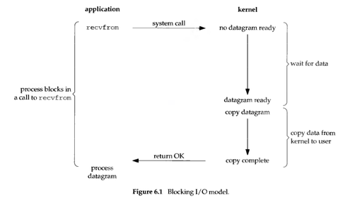
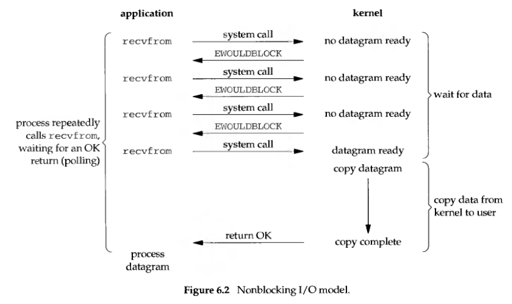
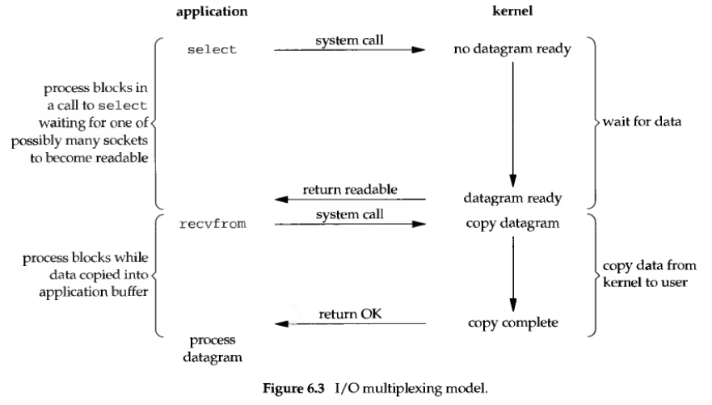
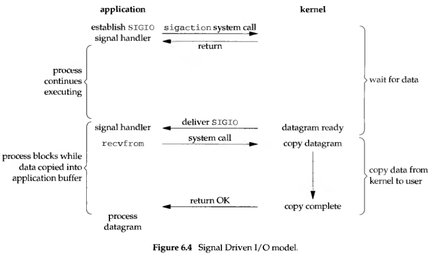
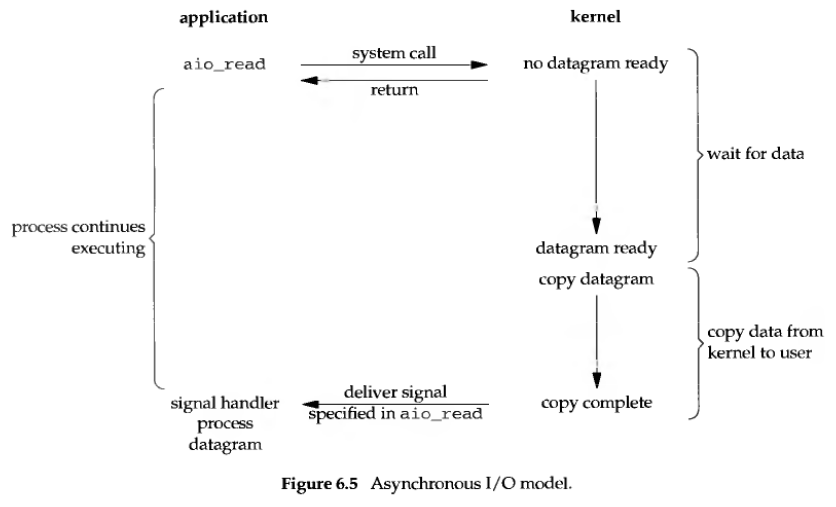
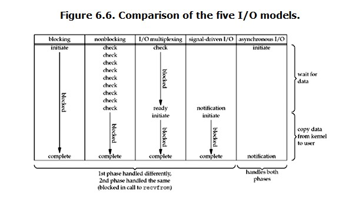

- Some concepts
  - Virtual Memory
    - A kind of physical memory management technology.
    - Make the process think he has a continuous memory addresses, actually maybe the addresses is distributed at different place in the memory, or even it is in external disk, when really need the data, need to do the swap(data switching).
    - Linux 'swap' technology.

  - In memory: User space vs Kernel space

  - context switch(process switch)
    - [Refer here](../../OS/README.20160417.context_switch.md)

  - process block
    - 'process block' is a pro-activeness, that is when a process expects some resources or some events, itself invoke the 'block primitive' to block itself.

  - fd(file descriptor)
    - It is a non-negative integer.
    - Actually it is an index value, point to one record in one kernel maintained records table which is used to record all the files had been opened by this process.

  - cache I/O
    - data route: kernel space -> page cache -> user space(process space)

- I/O models
  - blocking I/O
    - Block if request cannot be completed immediately.
    - 

  - non-blocking I/O
    - Do not block if request cannot be completed immediately, return error(EWOULDBLOCK) instead.
    - 

  - multiplexing I/O
    - select, poll, epoll, kqueue
    - 

  - Signal driven I/O
    - Tell kernel to notify application with SIGIO signal when the descriptor is ready.
    - 

  - Asynchronous I/O
    - Telling the kernel to start the operation and to notify application when the entire operation (including the copy of data from the kernel to application buffer) is complete.
    - 

- Comparison of I/O models
  - 

- select, poll, epoll/kqueue
  - epoll
    - LT(Level Trigger): continue to notify
    - ET(Edge Trigger): only will notify once

