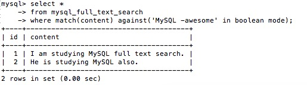

- The engine **MyISAM** supports full text search, but the engine **InnoDB** doesn't support

- Create table that supports full text search:
  - 
  - If you want to proceed the full text search on multiple columns, just put them all in `fulltext`.
  - After the definition, MySQL will help you maintain the index when creating a new record, updating/deleting an existing record.

- Insert some testing data
  - 

- Lets try to use the _full text search_ to get the records which contain string 'MySQL'

  ```
  select *
  from mysql_full_text_search
  where match(content) against('MySQL');
  ```
  - Then you will get:
    - 

  - `fulltext` search will order the result set for you automatically based on some factors.

  - Use `with query expansion`

  - `in boolean mode`

    ```
    select * 
    from mysql_full_text_search
    where match(content) against('MySQL -awesome' in boolean mode);
    ```
    - Then you will get:
      - 

- MySQL `fulltext` search 50% rule
  - If one word appears in more than 50% of the records, then this word will be treated as _stopwords_ and will be ignored.
  - 50% rule will not be applied in `in boolean mode`

- If the total data records in database are less than 3 rows, then `fulltext` will return empty result set.

- **'** will always be ignored, for esample: _don't_ will be indexed as _dont_


