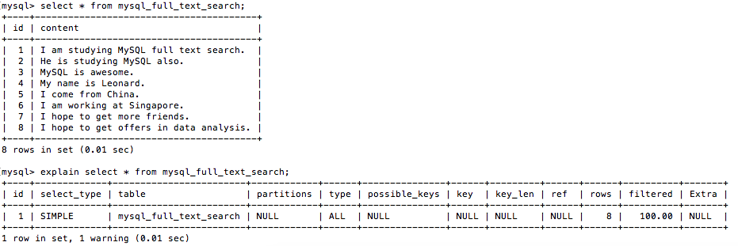

1. `index` in MySQL (B-Tree)
  - ~~space type column~~ supports R-Tree type index
    - Some other common ~~space type index~~: BSP-Tree, K-D-B-Tree, R-Tree, CELL-Tree

  - MEMORY table supports ~~hash index~~

  - Types
    - primary key index
    - unique index
    - `fulltext` index
    - normal index
    - union index(index on multiple columns)

  - When the index will be used
    - index on multiple columns (mostly if the left most column is referred in the query, the index will be used).
    - the field in `like` condition: '%abc', the index will not be used; 'abc%', the index still will be used.

  - When the index will not be used
    - The condition with `or`
    - Index on multiple columns, if it is not the left most column is referred in the query, then the index will not be used.
    - `like` begin with '%'
    - If the type of the column is varchar (string), then in the query condition, the condition value must be quoted by **"**.
    - If MySQL doing the query with `fulltext index` will be more efficient than with the index, then the index will not be used.

2. `explain` keyword in MySQL
  - Put `explain` keyword before the `select`, MySQL will explain to you how he executed the query: how he joined the tables, and what is the join order, it's very helpful to improve the performance of your SQL procedure.

    ```
    explain select *
    from emp
    left join dept on emp.dept_no = dept.dept_no
    ```

  - 
    - `id`: sequence no
    - `select_type`: can be the following values:
      - `simple`: simple query, no `join` and subquery
      - `primary`: the top level `select`
      - `union`:
      - `dependent union`: 
      - `union result`:
      - `subquery`:
      - `dependent subquery`:
      - `derived`:
    - `table`: all tables have been referred
    - `partitions`: 
    - `type`: join type
    - `possible_keys`: possible `indexes` will be used in this query
    - `key`: `indexex` really were used in this query
    - `key_len`: the length of the `index` has been used, this one will tell you exactly which index is used in the `union index`
    - `ref`: which fields or constants were also used with the `key` when filtering the records.
    - `rows`: data records have been checked by MySQL.
    - `filtered`
    - `Extra`: display some extra info, can be the following values:
      - `distinct`
      - `not exists`
      - `using filesort`
      - `using index`
      - `using temporary`
      - `using where`


