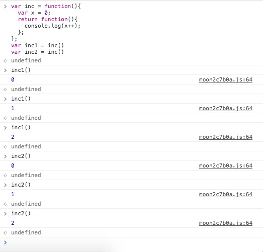

1. `read-only` permission

  ```
  >>> x = 100
  >>> def test():
  ...   x += 1
  ...   print(x)
  ... 
  >>> test()
  Traceback (most recent call last):
    File "<stdin>", line 1, in <module>
    File "<stdin>", line 2, in test
  UnboundLocalError: local variable 'x' referenced before assignment
  >>> 
  ```

2. Add the `global` declaration

  ```
  >>> x = 100
  >>> def test():
  ...   global x
  ...   x += 1
  ...   print(x)
  ... 
  >>> test()
  101
  >>> x
  101
  >>> 
  ```

3. `global` vs `nonlocal` in Python 3.5
  - `global`: 指向当前模块的全局变量
  - `nonlocal`: 指向 最内层之外 global之内的 变量
  - The reason for having `global` and `nonlocal` please refer to 1. `read-only` permission

4. closure in Python
  - closure in JavaScript
    - 

  - closure in Python 3.5.0

    ```
    >>> def inc():
    ...   x = 0
    ...   def inner():
    ...     nonlocal x
    ...     x += 1
    ...     print(x)
    ...   return inner
    ... 
    >>> inc1 = inc()
    >>> inc2 = inc()
    >>> 
    >>> inc1()
    1
    >>> inc1()
    2
    >>> inc1()
    3
    >>> inc2()
    1
    >>> inc2()
    2
    >>> 
    ```

  - closure in Python 2.7.10

    ```
    [leonard@Leonards-Air ~/projects/practice-and-accumulation]$ python
    Python 2.7.10 (default, Sep 23 2015, 04:34:21) 
    [GCC 4.2.1 Compatible Apple LLVM 7.0.0 (clang-700.0.72)] on darwin
    Type "help", "copyright", "credits" or "license" for more information.
    >>> def inc():
    ...   x = [0]
    ...   def inner():
    ...     x[0] += 1
    ...     print(x[0])
    ...   return inner
    ... 
    >>> inc1 = inc()
    >>> inc2 = inc()
    >>> inc1()
    1
    >>> inc1()
    2
    >>> inc1()
    3
    >>> inc2()
    1
    >>> inc2()
    2
    >>> inc2()
    3
    >>> 
    ```


