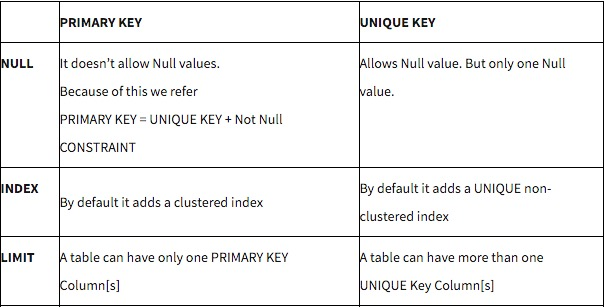
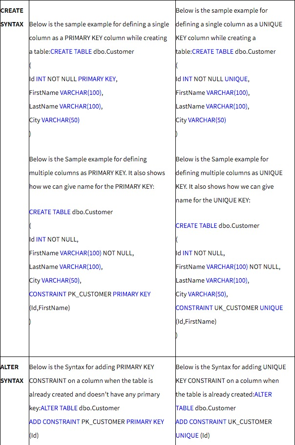
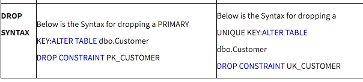

1. Compare 'TRUNCATE' and 'DELETE' in SQL.
  - If you want to quickly delete all of the rows from a table, and you're really sure that you want to do it, and you do not have foreign keys against the tables, then a TRUNCATE is probably going to be faster than a DELETE.

  - Various system-specific issues have to be considered, as detailed below.
    - **Statement type**
      - Delete is DML(Data Manipulation Language), Truncate is DDL(Data Definition Language)

      - More details
        - **DDL - Data Definition Language(DDL)** statements are used to define the database structure or schema. Some examples:
          - CREATE - to create objects in the database
          - ALTER - alters the structure of the database
          - DROP - delete objects from the database
          - TRUNCATE - remove all records from a table, including all spaces allocated for the records are removed
          - COMMENT - add comments to the data dictionary
          - RENAME - rename an object

        - **DML - Data Manipulation Language(DML)** statements are used for managing data within schema objects. Some examples:
          - SELECT - retrieve data from the a database
          - INSERT - insert data into a table
          - UPDATE - updates existing data within a table
          - DELETE - deletes all records from a table, the space for the records remain
          - MERGE - UPSERT operation (insert or update)
          - CALL - call a PL/SQL or Java subprogram
          - EXPLAIN PLAN - explain access path to data
          - LOCK TABLE - control concurrency

        - **DCL - Data Control Language(DCL)** statements. Some examples:
          - GRANT - gives user's access privileges to database
          - REVOKE - withdraw access privileges given with the GRANT command

        - **TCL - Transaction Control(TCL)** statements are used to manage the changes made by DML statements. It allows statements to be grouped together into logical transactions.
          - COMMIT - save work done
          - SAVEPOINT - identify a point in a transaction to which you can later roll back
          - ROLLBACK - restore database to original since the last COMMIT
          - SET TRANSACTION - Change transaction options like isolation level and what rollback segment to use

    - **Commit and Rollback**, Variable by vendor
      - SQL*Server, PostgreSQL: Truncate can be rolled back.
      - Oracle: Because a TRUNCATE is DDL it involves two commits, one before and one after the statement execution. Truncate can therefore not be rolled back, and a failure in the truncate process will have issued a commit anyway.

    - **Space reclamation**
      - _DELETE_ does not recover space, _TRUNCATE_ recovers space
      - Oracle: If you use the REUSE STORAGE clause then the data segments are not de-allocated, which can be marginally more efficient if the table is to be reloaded with data. The high water mark is reset.

    - **Row scope**
      - ~~Delete can remove only some rows. Truncate removes all rows???~~
      - Oracle: When a table is partitioned, the individual partitions can be truncated in isolation, thus a partial removal of all the table's data is possible.

    - **Object types**
      - ~~Delete can be applied to tables and tables inside a cluster. Truncate applies only to tables or the entire cluster. (May be Oracle specific)???~~

    - **Data Object Identity**
      - Oracle: Delete does not affect the data object id, but truncate assigns a new data object id unless there has never been an insert against the table since its creation Even a single insert that is rolled back will cause a new data object id to be assigned upon truncation.

    - **Flashback (Oracle)**
      - Flashback works across deletes, but a truncate prevents flashback to states prior to the operation.
      - However, from 11gR2 the FLASHBACK ARCHIVE feature allows this, except in Express Edition
        - [Use of FLASHBACK in Oracle](http://stackoverflow.com/questions/25950145/use-of-flashback-in-oracle)
        - [Docs](http://docs.oracle.com/cd/E11882_01/appdev.112/e41502/adfns_flashback.htm#ADFNS638)

    - **Privileges**
      - Oracle: Delete can be granted on a table to another user or role, but truncate cannot be without using a DROP ANY TABLE grant.

    - **Redo/Undo**
      - Delete generates a small amount of redo and a large amount of undo.
      - Truncate generates a negligible amount of each.

    - **Indexes**
      - Oracle: A _TRUNCATE_ operation renders unusable indexes usable again. _DELETE_ does not.

    - **Foreign Keys**
      - A truncate cannot be applied when an enabled foreign key references the table.
      - Treatment with delete depends on the configuration of the foreign keys.

    - **Table Locking**
      - Oracle: Truncate requires an exclusive table lock, delete requires a shared table lock. Hence disabling table locks is a way of preventing truncate operations on a table.

    - **Triggers**
      - DML triggers do not fire on a truncate.

    - **Remote Execution**
      - Oracle: Truncate cannot be issued over a database link.

    - **Identity Columns**
      - SQL*Server: Truncate resets the sequence for IDENTITY column types, delete does not.

  - [More details and discussion refer to this link](http://stackoverflow.com/questions/139630/whats-the-difference-between-truncate-and-delete-in-sql)

2. primary key vs unique key
  - 
  - 
  - 

3. What is transaction

