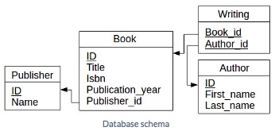
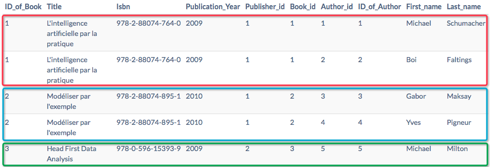
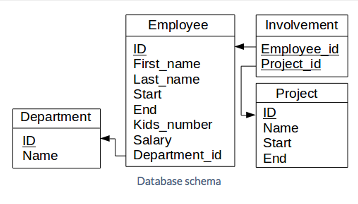
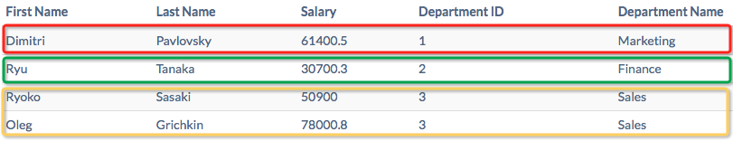
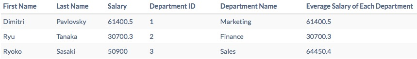

1. http://www.tutorialspoint.com/sql/sql-useful-functions.htm
  - sum(), avg(), count(), max(), min(), sqrt(), rand(), concat()
  - Nemeric:
    - [conv()](http://www.tutorialspoint.com/sql/sql-numeric-functions.htm#function_conv)
    - [atan2()](https://zh.wikipedia.org/zh-cn/Atan2)
  - String
    - [SQL - String Functions](http://www.tutorialspoint.com/sql/sql-string-functions.htm)
    - [ascii()](http://www.tutorialspoint.com/sql/sql-string-functions.htm#function_ascii)

2. where first_name is NULL

3. **join**
  - [FROM (Transact-SQL)](https://msdn.microsoft.com/en-us/library/ms177634%28SQL.90%29.aspx)
  - [Left join and Left outer join](http://stackoverflow.com/questions/406294/left-join-and-left-outer-join-in-sql-server)
  - [SQL left join vs multiple tables on FROM line?](http://stackoverflow.com/questions/894490/sql-left-join-vs-multiple-tables-on-from-line/894659#894659)
  - [What is SELF JOIN and when would you use it?](http://stackoverflow.com/questions/3362038/what-is-self-join-and-when-would-you-use-it)

  - [Difference between INNER and OUTER joins](http://stackoverflow.com/questions/38549/difference-between-inner-and-outer-joins)

  - **inner join** equal with **join**
    - [Difference between JOIN and INNER JOIN](http://stackoverflow.com/questions/565620/difference-between-join-and-inner-join)
  - **left join** equal with **left outer join**
  - **right join** equal with **right outer join**
  - **full join** equal with **full outer join**
  - **cross join** equal with **cartesian join**
    - [When to use 'cross join'?](http://stackoverflow.com/questions/219716/what-are-the-uses-for-cross-join)

4. **group by** and **having**
  - http://studybyyourself.com/seminar/sql/course/chapter-7-subgroup/?lang=en
  - [Using group by on multiple columns](http://stackoverflow.com/questions/2421388/using-group-by-on-multiple-columns)
  - Example:
    - Database schema
      - 
    - Question
      - Provide data about all books having been written by Andrew Duncan only, i.e. without any other co-authors.
    - Solution
    
      ```
      select
        a.id as ID_of_Book,
        a.title as Title,
        a.isbn as Isbn,
        a.publication_year as Publication_Year,
        a.publisher_id as Publisher_id,
        b.book_id as Book_id,
        b.author_id as Author_id,
        c.id as ID_of_Author,
        c.first_name as First_name,
        c.last_name as Last_name
      from Book as a
        join Writing as b on a.id = b.book_id
        join Author as c on b.author_id = c.id
      group by a.id
      having count(*) = 1 and c.first_name = 'Andrew' and c.last_name = 'Duncan'
      ```
    - Explanation and critical points
      - First 'joins' have to be done among tables: Book, Writing and Author, here you should imagine you will get a middle records like the below image shows:
        - 
      - Then meet the 'group by' and 'having' statements:
        - The 'group by' statement will proceed the 'group operation' by the condition given by you after the 'by' and form the records into several groups(like the coloured boxs in above pic), then proceed the 'having conditions' on **EACH GROUP, here you should pay enough attention to _EACH GROUP_, not: proceed 'having conditions' on those records inside each group, but _EACH GROUP_, that means only having two results:**
          - **Keep this group.**
          - **Omit this group.**
          - **As how to choose one record from those kept groups, and then form into the output, you told no clue to SQL how to do that, so probably it depends on how SQL throws the dice.**
          - So:
            - **Here require you to make all the records inside a group are same in a sense to your query, that is: choosing which record doesn't matter.**

          - Lets go through this with an example:
            - Database schema
              - 
            - Question
              - Provide data about all employees whose salary is higher or equal to the average salary of employees working in the same department (regardless if employees have left the company or not). Required attributes are last name, first name, salary and department name.
            - Step by step
              - Code and corresponding result image:

                ```
                select
                  a.first_name as 'First Name',
                  a.last_name as 'Last Name',
                  a.salary as 'Salary',
                  b.id as 'Department ID',
                  b.name as 'Department Name'
                from Employee as a
                  join Department as b on a.department_id = b.id
                ```
                - 

              - Modified code and corresponding image:

                ```
                select
                  a.first_name as 'First Name',
                  a.last_name as 'Last Name',
                  a.salary as 'Salary',
                  b.id as 'Department ID',
                  b.name as 'Department Name',
                  cast(avg(a.salary) as decimal(10, 1)) as 'Everage Salary of Each Department'
                from Employee as a
                  join Department as b on a.department_id = b.id
                group by b.id
                ```
                - 

              - **Do you think the above solution will work or not?**

                ```
                select
                  a.first_name as 'First Name',
                  a.last_name as 'Last Name',
                  a.salary as 'Salary',
                  b.id as 'Department ID',
                  b.name as 'Department Name',
                  cast(avg(a.salary) as decimal(10, 1)) as 'Everage Salary of Each Department'
                from Employee as a
                  join Department as b on a.department_id = b.id
                group by b.id
                having cast(a.salary as decimal(10, 1)) >= cast(avg(a.salary) as decimal(10, 1))
                ```
              
                - **The answer is _NO_, and perhaps you will experience: sometimes you do exactly get what you want, but sometimes you can't, that is what I mean by 'so probably it depends on how SQL throws the dice'.**

              - Actually if only you fully understand the 'group by', you will find this is a totally wrong thinking for trying to solve this question, coz after 'bgoup by', each group may has more than one record need to be in the final records.

              - **Again:**
                - **All the records inside a group are same in a sense to your query, that is: choosing which record doesn't matter.**
                - **If one group is not empty, and then will _HAVE ONE_ and must will _ONLY HAVE ONE_ record goes into the output, but which one depends on how SQL throws the dice'.**

              - [SQL vs MySQL: Rules about aggregate operations and GROUP BY](http://stackoverflow.com/questions/12843303/sql-vs-mysql-rules-about-aggregate-operations-and-group-by)

      - When proceed the join operation, if two tables have the same column, then some SQL product will use the later one override the previous one.
      - So:
        - **Never use '*' in the 'select', this is a very important good practice.**
        - **If two tables have same columns, then rename them use 'as' in 'select' will get around of this problem.**


